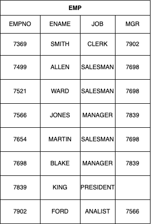

관계를 맺는 것은 부모의 식별자를 자식에게 상속시키는 행위이다. 이때 부모의 식별자를 자식의 식별자로 포함하면 식별관계, 부모 식별자를 자식의 일반속성으로 상속하면 비식별관계이다. 관계를 맺는다는 건 식별자를 상속하고, 상속된 속성을 매핑키로 활용하여 데이터를 결합해 볼 수 있다는 의미이다.
이를 SQL에서는 '조인(join)'이라 한다.

엔터티 간 관계를 맺는다는 것은 데이터를 연결해서 볼 수 있음을 의미한다. 그래서 관계라는 선으로 이어준다. 두 데이터 집합 간 연결고리, 즉 매핑키를 통해 데이터를 연결할 수 있기 때문이다.

# 조인


위의 모델은 고객과 주문 엔터티가 관계를 맺고 있는 모습이다.

\- 한 명의 고객은 여러번 주문할 수 있다.
\- 각각의 주문은 반드시 한 명의 고객에 의해서 발생한다.

관계를 맺음으로서 생기는 현상은 고객 엔터티의 식별자인 고객번호를 주문 엔터티에 상속시킨 것이다. 즉 관계를 맺는다는 것은 식별자를 상속시키고 해당 식별자를 매핑키로 활용해 데이터를 결합한다는 것이다.


관계를 통해 주문번호에 해당하는 고객명을 찾는 프로세스는 다음과 같다.

1. 주문 데이터에서 주문번호가 110001인 데이터를 찾는다.
2. 주문번호가 110001 인 데이터의 행에서 고객번호가 100임을 찾는다
3. 고객 테이블에서 고객번호가 100 인 행을 찾는다.
4. 고객번호가 100인 행에서 고객명이 '정우진' 이라는 것을 확인한다.

관계에 의해 상속된 고객번호라는 속성을 가지고 주문 데이터에서 매핑키로 고객명을 찾아냈다. 2번과 3번이 조인이고, 고객번호가 바로 '조인키' 이다. 이를 통해 SQL로 작성하고, 앞 순서와 연결해 본다면 다음과 같다.

```sql
SELECT B.고객명 ---- 4
FROM  주문 A, 고객 B
WHERE A.주문번호 = '1100001' ----- 1
AND A.고객번호 = B.고객번호 ----- 2, 3
```

---

# 계층형 데이터 모델

하나의 엔터티에서 관계가 발생하는 경우도 있다.


계층형 데이터모델이란 말 그대로 계층 구조를 가진 데이터를 지칭하는 것이다.



MGR 속성은 각 사원 관리자의 사원번호를 의미한다. 관리자를 찾아가는 과정을 SQL로 표현하면 다음과 같다.

```sql
SELECT B.ENAME --- 4
FROM EMP A, EMP B
WHERE A.ENAME = B.ENAME  --- 1
AND A.MGR = B.EMPNO --- 2, 3
```

1. EMP A 에서 ENAME 이 'SMITH' 인 데이터를 찾는다.
2. EMP A 에서 ENAME이 'SMITH' 인 데이터의 행에서 MRG 가 '7902' 라는 것을 확인한다.
3. EMP B 에서 EMPNO 가 7902인 데이터를 찾는다.
4. EMP B 에서 EMPNO가 7902인 데이터 행의 ENAME 이 'FORM' 라는 것을 확인한다.

이전과 다른 점은 자기 자신을 조인했다는 것이다. 이를 셀프조인이라고 하단. 셀프조인이 가능한이유는 MGR 속성값에 EMPNO 의 속성값이 들어가기 때문이다.
즉, MGR 과 EMPNO를 매핑키로 조인하는 것이다.

계층형 데이터 모델의 대표적인 예는 쇼핑몰 카테고리 정보가 있다.

---

## 상호배타적 관계

상호 베타적 관계는 업무에 따라 얼마든지 만날 수 있으므로 개념 정도는 숙지하고 있어야한다.


위의 모델은 개인, 법인 고객이 존재하는 모델에서 주문과의 상호베타적 관계를 표현하고 있다.
관계의 베타적관계로서 주문 엔터티는 개인 또는 뻐인 둘 중 하나만 상속될 수 있음을 의미한다. 즉 주문은 개인고객이거나 법인고객 둘 중 하나만 가능하다.


개인/법인번호는 개인고객 또는 법인고객의 식별자가 상속된 값이다. 이때 고객구분코드의 값을 통해 개인고객의 식별자가 상속되었는지 법인고객의 식별자가 상속되었는지 나타낸다.
주문번호가 1100001인 주문의 주문자명을 보여주고 싶을 때는 SQL을 다음과 같이 작성한다.

```sql
SELECT B.개인고객명
FROM 주문 A, 개인고객 B
WHERE A.주문번호 = '1100001'
AND A.고객구분코드 = '01'
AND A.개인/법인번호 = B.개인번호
UNION ALL
SELECT B.법인고객명
FROM 주문 A, 법인고객 B
WHERE A.주문번호 = '1100001'
AND A.고객구분코드 = '02'
AND A.개인/법인번호 = B.법인번호
```

고객 구분코드를 알 수 있다면 명확하게 개인고객 또는 법인고객 테이블을 선택하여 하나의 테이블만 조인하여 SQL 을 작성할 수 있다. 그렇지 않은 경우 위와 같은 SQL이 최선일 것이다.
이때 주의할 점은 개인번호와 법인번호의 중복이 발생되어서는 안된다는 것이다. 중복된다면 2건의 데이터가 출력될 수 있다.
이에 해당하는 경우라면 고객구분코드의 값을 반드시 변수로 받아야한다.

개인번호와 법인번호가 중복되지 않는다는 전재가 있다면 다음과 같은 SQL도 가능하다.

```sql
SELECT COALESCE(B.개인고객명, C.법인병) 고객명
FROM 주문 A LEFT OUTER JOIN 개인고객 B
ON(A.개인/법인번호 = B.개인번호) LEFT OUTER JOIN 법인고객 C
ON (A.개인/법인번호 = C.법인번호)
WHERE A.주문번호 = 1100001;
```

개인번호와 법인법호는 중복되지 않기 때문에 아우터 조인으로 연결한다. 둘중 하나는 조인에 성공한다. 단, SELECT 절에서는 조인되는 테이블의 고객명을 가져와야 하기에 COALESCE 함수를 사용한다.
두 방식의 SQL의 차이점을 생각해보면, UNION ALL을 사용한 첫 번째 SQL은 조인되는 결과가 없다면 공집합을 출력한다.
아우터 조인을 활용한 두번째 SQL은 조인되는 결과가 없다면 NULL 값을 가진 한 건의 ROWS를 출력한다. 모델 상으로는 반드시 둘 중 하나의 값을 가져야 하지만, 데이터 품질문제로 이와 같은 결과가 출력될 수 있다.
